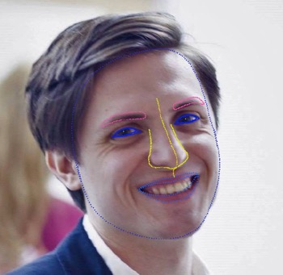
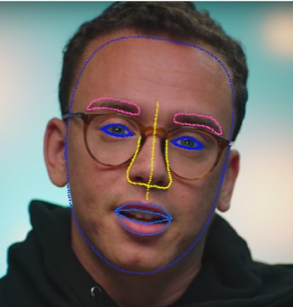

# NN, предсказывающая координаты 971 точек лица

В этом репозитории вы найдете код обучения нейронной сети, предсказывающей координаты 971 точек лица.

Сеть обучалась на основе датасета из 393 930 фотографий.

Пример работы нейронной сети:

# Описание обучения и предсказания

1. Были подготовлены функции для обработки изображений
2. Далее были подготовлены функции для обучения, валидации и предсказания результатов
3. Читаем и трансформируем данные для обучения и валидации. Размер батча - 256
4. Определяем модель (предобученная resnet50), функцию потерь, метод оптимизации. В качестве функции потерь лучше всего себя показала smooth_l1_loss, также была опробирована WingLoss
5. Добавляем дополнительный линейный слой над предобученной моделью
6. Обучение и валидация модели
7. Генерируем предсказание для загрузки
