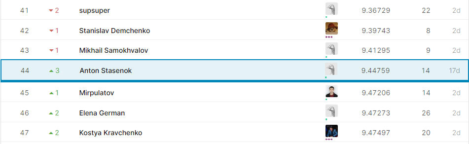
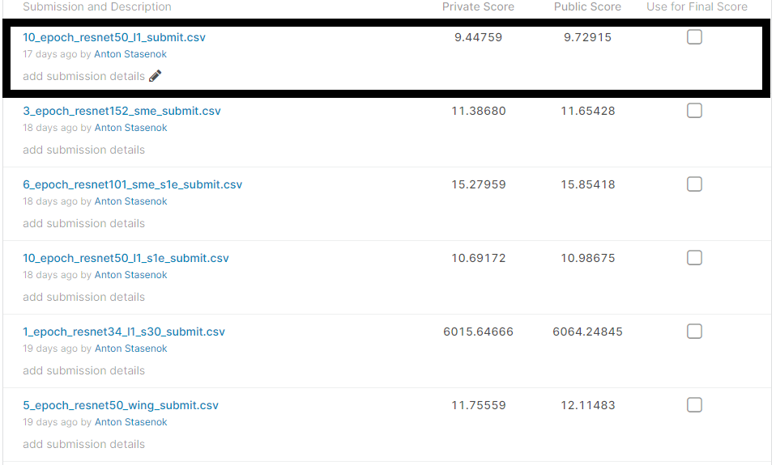

# Домашнее задание № 1 по CV MADE: Thousand Facial Landmarks Competition

В этом репозитории вы найдете код решения Kaggle InClass соревнования "Thousand Facial Landmarks", проходившего рамках курса MADE Computer Vision.

Задачей соревнования было предсказать координаты 971 точек лица на основе датасета из 393 930 фотографий.

В данном соревновании я занял 44 место.

Для решения задания использовал мощности Amazon Web Services любезно предоставленные организаторами [made](https://data.mail.ru/). За что им отдельное спасибо. 

# Описание решения

1. Подготавливается набор преобразователей данных
2. Читаются данные с применением трансформаций
3. Загрузка предобученной модели resnet50
4. Добавление собственной надстройки над предобученной моделью
5. Обучение и валидация модели
6. Формирование сабмита

Скриншот сабмитов:
